# RayTracer — 삼각형 없는 해석적 CSG 레이 트레이서 (iOS · macOS, Metal Ray Tracing)

**An analytic CSG ray tracer on Apple's Metal Ray Tracing API — no triangles, no meshes.**
Every object is a boolean expression of mathematical primitives (sphere, box, torus, rounded box,
Bézier tube, smooth-min metaballs …) intersected in closed form inside a custom
`[[intersection(bounding_box, instancing)]]` function.

버스·시계 무브먼트·제트엔진 커터웨이·인물 흉상·아이언맨 슈트까지 전부 **수식으로 교차**하고,
`|` `&` `-` 로 조립한다. 메시가 아니라서 곡면이 완전히 매끈하고, 부품은 "단위 크기 하나"만 있으면 된다.

<table>
<tr>
<td width="50%">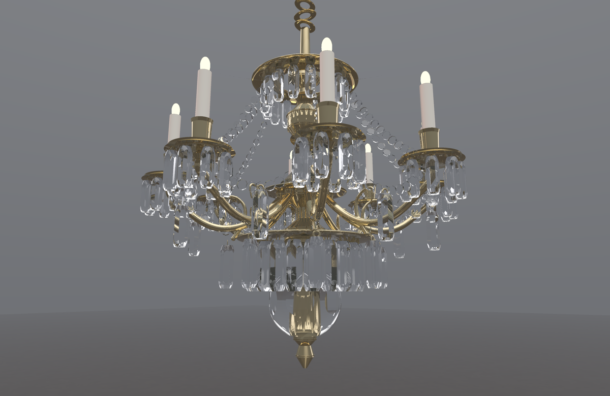<br><sub><b>파티룸의 샹들리에</b> — 깎은 크리스털 450개(팔각기둥 ∩ 타원체)를 오브젝트 둘로 인스턴싱, 황동 팔은 베지에 튜브. 샴페인 잔·병·케이크·선물·풍선·전구 줄·깃발까지 인스턴스 700개, 오브젝트 27개</sub></td>
<td width="50%">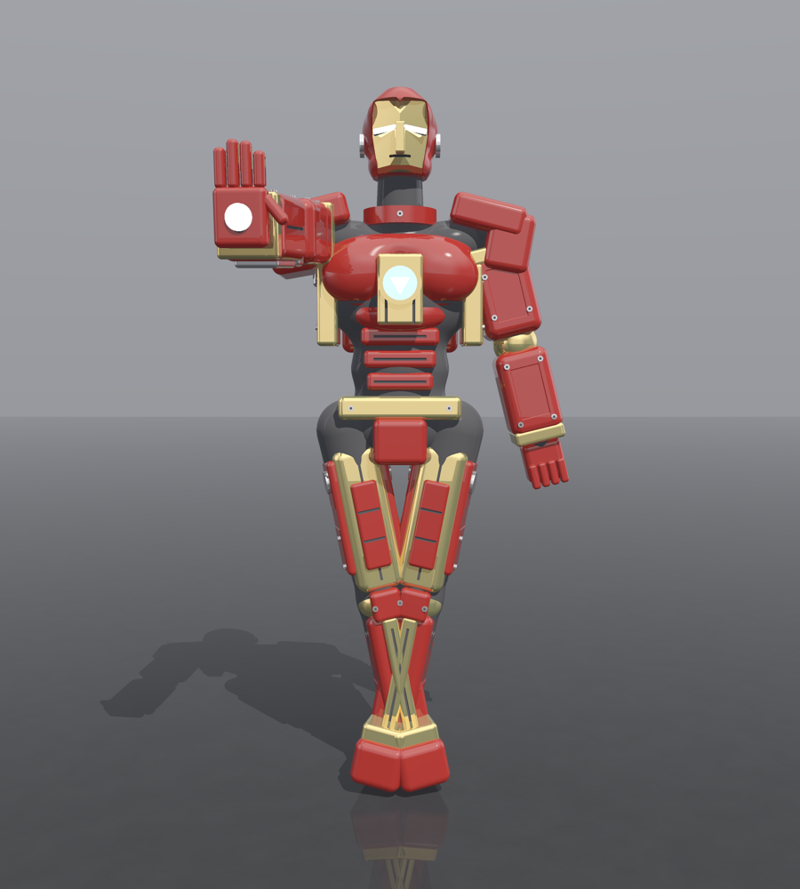<br><sub><b>파워드 아머</b> — 캔디 도장 · 새틴 금속 · 발광 리액터 · 패널 라인과 인스턴싱된 볼트 50개</sub></td>
</tr>
<tr>
<td>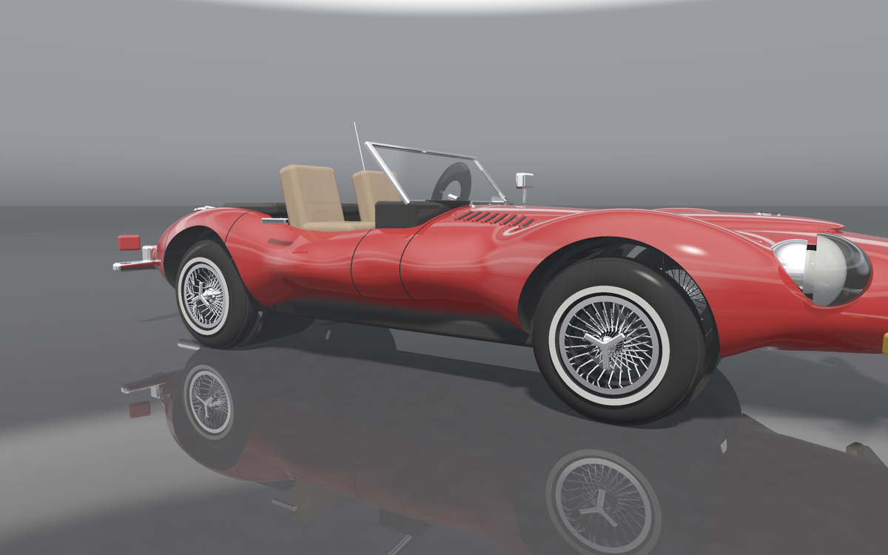<br><sub><b>클래식 스포츠카</b> — 타원체 11개를 smooth-min 으로 섞은 차체를 바닥 평면·휠 아치·콕핏·그릴 입으로 잘라 낸 것. 캔디 도장, 크롬, 유리 덮개 헤드라이트, 와이어 휠 스포크 192개 인스턴싱</sub></td>
<td>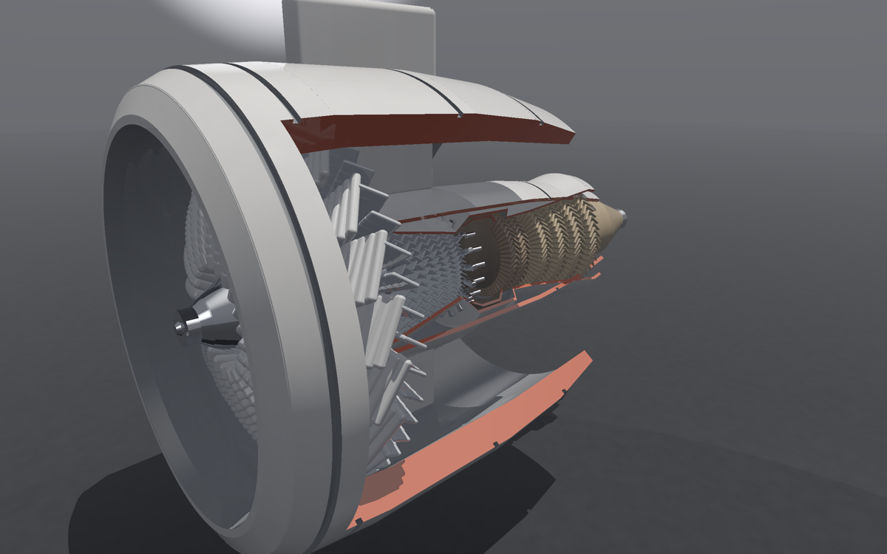<br><sub><b>터보팬 제트엔진 커터웨이</b> — 블레이드 1,500장을 오브젝트 40개로 인스턴싱, 사분면 하나를 빼서 카울을 걷어낸 단면(절단면 색은 공짜)</sub></td>
</tr>
<tr>
<td>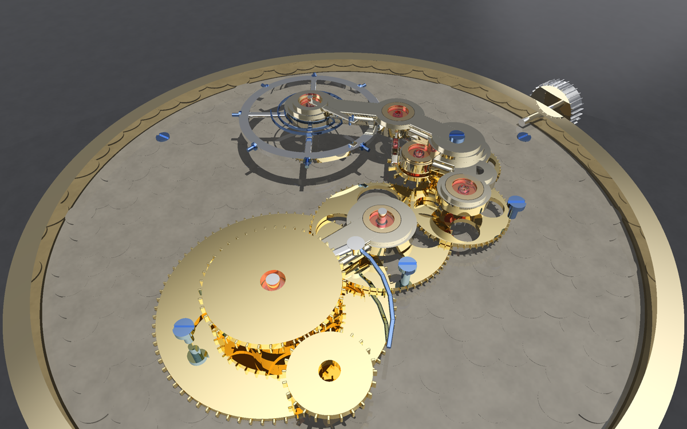<br><sub><b>기계식 시계 무브먼트</b> — 기어 트레인 · 탈진기 · 헤어스프링 · 루비 보석. 전부 불리언 가공물, 스튜디오 소프트박스가 금속에 비친다</sub></td>
<td>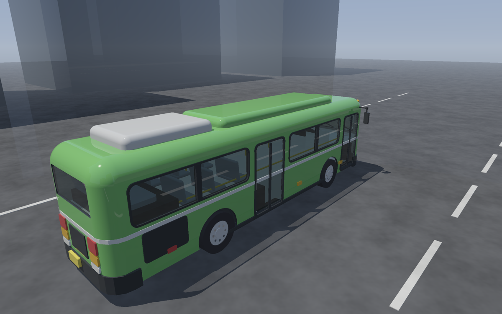<br><sub><b>시내버스</b> — 민코프스키 둥근 상자 차체 · 실내와 좌석 · 유리 · 부품 62개</sub></td>
</tr>
<tr>
<td>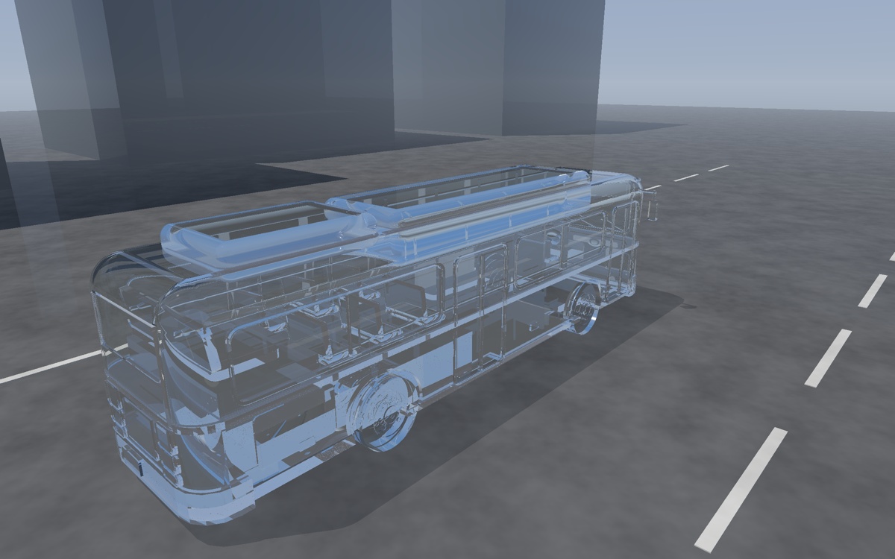<br><sub><b>유리 버스</b> — 같은 형상을 굴절·프레넬만으로. 재질 매핑만 바뀐다</sub></td>
<td>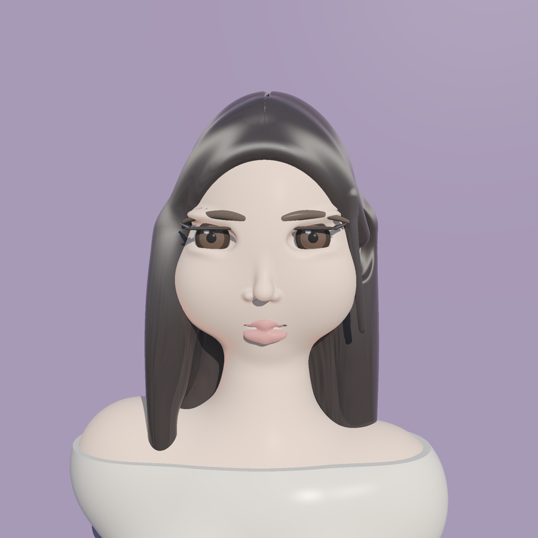<br><sub><b>인물 흉상</b> — smooth-min 거리장(메타볼 + 베지에 튜브)으로 조각, 피부 표면하 산란, 비등방 머리카락</sub></td>
</tr>
<tr>
<td>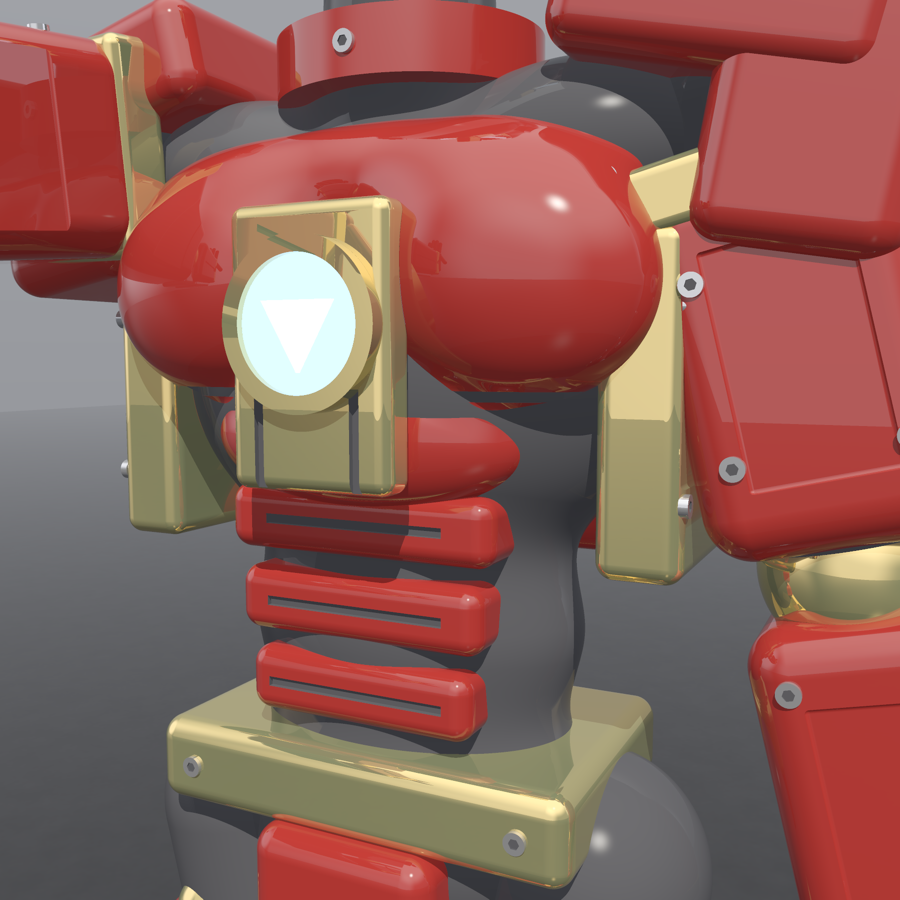<br><sub><b>아머 클로즈업</b> — 음각 패널, 홈, 육각 볼트, 새틴 금속의 착색 프레넬</sub></td>
<td>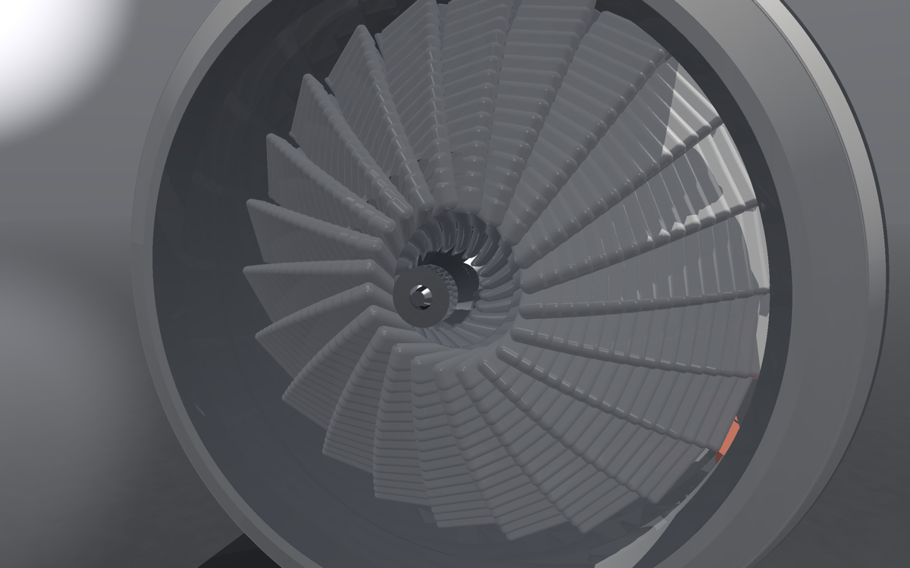<br><sub><b>터보팬 정면</b> — 와이드 코드 팬 블레이드 22장, 스윕과 비틀림은 둥근 상자 조각을 겹쳐 쌓은 것</sub></td>
</tr>
<tr>
<td>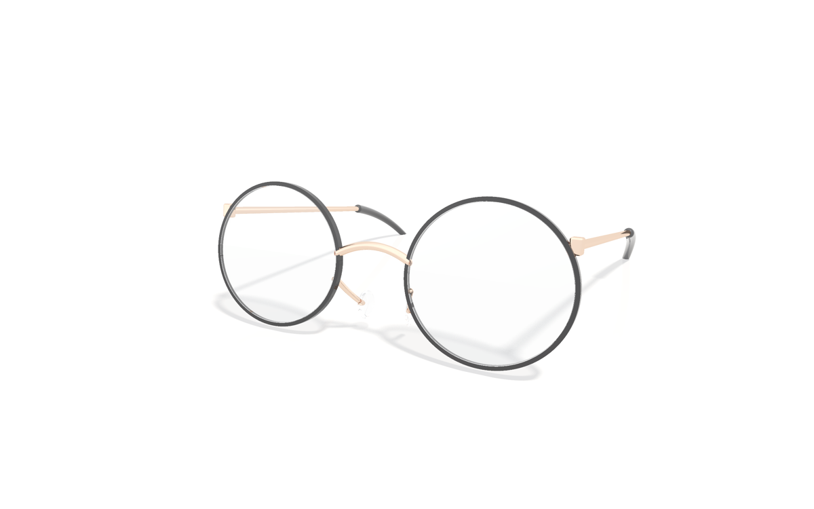<br><sub><b>안경</b> — 흰 사이클로라마 · 면광원 소프트 섀도 · 4 spp · 굴절률 1.5 렌즈</sub></td>
<td>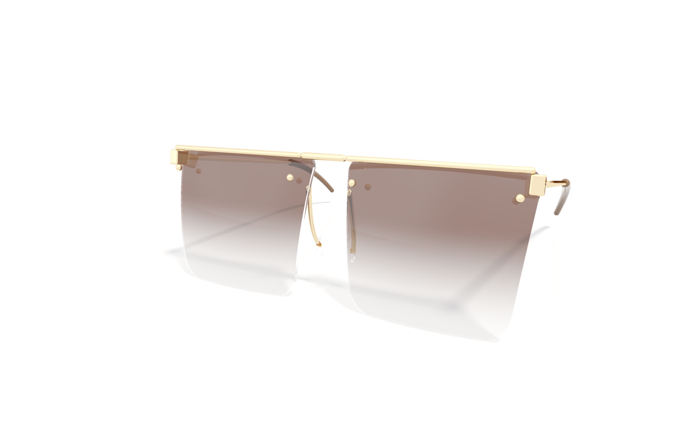<br><sub><b>썬글라스</b> — 베이스 커브를 준 렌즈에 높이 그라데이션 착색 유리</sub></td>
</tr>
<tr>
<td>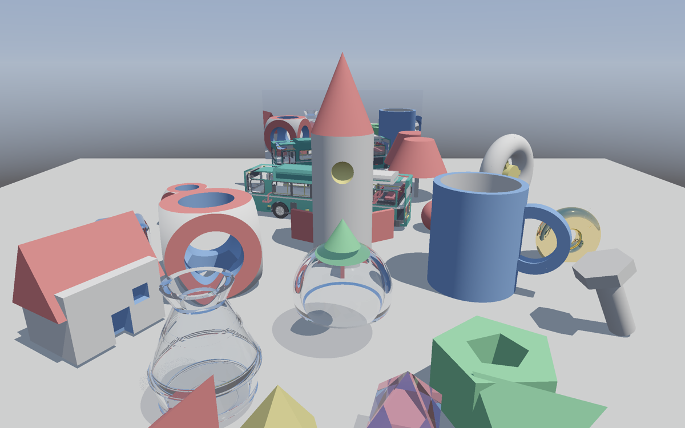<br><sub><b>부품 전시장</b> — 해석적 부품 16종 + 불리언 조립 · 거울과 유리</sub></td>
<td></td>
</tr>
</table>

이미지는 전부 이 앱의 **스냅샷 모드**로 렌더한 것이다 (`make gallery` 로 다시 뽑는다).
앱에서는 드래그로 돌려 보고 **저장** 버튼으로 고해상도 PNG 를 뽑을 수 있다.

## 무엇이 들어 있나

| | |
|---|---|
| **해석적 부품 20종** | 구 · 박스 · 원기둥 · 원뿔 · 원뿔대 · 토러스(4차 방정식) · 캡슐 · 링 · 다각기둥 · 임의 볼록 다면체 · **민코프스키 둥근 상자**(꼭짓점까지 구면) · 회전체 |
| **`CSG.blob` — 거리장 부품** | 타원체(회전 가능) · 둥근 원뿔 · **2차 베지에 튜브**를 smooth-min 으로 섞어 구 추적. 이어 붙는 자리가 없어 인체·머리카락 같은 유기적 형상이 된다 |
| **구간 불리언** | 후위 표기 스택 머신이 레이 위의 구간 리스트에 `∪ ∩ −` 를 적용. 차집합의 절단면은 자르는 쪽 재질을 물려받는다 (커터웨이 단면 색이 공짜) |
| **인스턴싱** | 오브젝트 하나 = AABB 하나 = 가속 구조 하나. 블레이드 1,500장·볼트 50개는 배치 변환만 다르다 |
| **재질** | 확산(클리어코트 프레넬) · 거울 · 유리(스넬 + Schlick, 높이 그라데이션 착색) · **새틴 금속** · **머리카락**(Kajiya-Kay 비등방) · **발광** · 피부 **표면하 산란** 근사 |
| **조명** | 야외 하늘 · 어두운 스튜디오 · 밝은 스튜디오 · 흰 사이클로라마, 면광원 소프트 섀도, 2×2 슈퍼샘플링(패스 누적), 씬별 노출·최대 바운스 |
| **GPU 워치독 대응** | 한 프레임을 **샘플 패스 × 가로 띠**의 커맨드 버퍼로 나눈다. 스레드 하나가 오래 돌면 GPU 가 스레드그룹을 소리 없이 죽여 흰 타일이 남는다 — 유리 450개짜리 샹들리에에서 배웠다 |
| **A15 급 기기에서 동작** | intersection function 의 스레드 스택을 1.8 KB 로 눌러 iPhone 13 에서도 파이프라인이 만들어진다 |

## 빠른 시작

```bash
brew install xcodegen
make project     # project.yml → RayTracer.xcodeproj
make run         # macOS 앱
make snapshot SCENE=turbofan OUT=out/frame.png   # 창 없이 한 프레임
```

Metal Ray Tracing 을 지원하는 기기가 필요하다 (**A13 / M1 이상**, 시뮬레이터 불가).
실기기 서명은 `make team TEAM=XXXXXXXXXX` — 자세한 것은 아래 [빌드 · 실행](#빌드--실행).

---

## 조립 예 (Scene.swift)

```swift
let core  = CSG.box(material: red) & CSG.sphere(.scale(1.4), material: white)
let holeY = CSG.cylinder(.scale(0.6, 1.3, 0.6), material: blue)
let die   = core - (holeY.transformed(.rotateZ(90)) | holeY | holeY.transformed(.rotateX(90)))
```

변환은 `.translate(x,y,z) * .rotateY(deg) * .scale(s)` 처럼 오른쪽부터 적용된다.
조립체 전체를 옮기려면 `.transformed(matrix)`, 여러 개 합치려면 `CSG.unionAll([...])`.

## 동작 원리

| 단계 | 위치 |
|---|---|
| CSG 트리 → 후위 표기 노드 배열 | `CSG.flatten` (Swift) |
| 오브젝트 하나 = AABB 1개 = primitive 가속 구조 1개 | `Renderer.buildAccelerationStructures` |
| 씬 정의 (재질 · 오브젝트 · 배치) | `CSGScene` — SwiftUI의 `Scene` 과 이름이 겹쳐서 이 이름이다 |
| 배치(인스턴스) = 인스턴스 가속 구조 | 위와 동일 |
| 레이 ↔ 오브젝트 교차 = `[[intersection(bounding_box, instancing)]]` 함수 | `Shaders.metal: csgIntersection` |
| 부품별 해석적 교차 → 구간 [tIn, tOut] | `candSphere/Box/Cylinder/Cone/Torus/Capsule/Prism`, `partIntervals` |
| 토러스 4차 방정식 풀이 | `solveQuartic` (Ferrari + Newton 보정) |
| 볼록 다면체 일반 루틴 (프리즘 등) | `candPlanes` — 평면 배열만 주면 새 다면체 추가 가능 |
| 구간 리스트 불리언 연산 (스택 머신) | `opUnion / opIntersect / opSubtract`, `evalCSG` |
| 첫 경계 → 법선/재질 payload → 셰이딩 | `rtKernel` |

## 빌드 · 실행

`RayTracer.xcodeproj` 는 [XcodeGen](https://github.com/yonaskolb/XcodeGen) 이 `project.yml` 로부터
생성한다 (`brew install xcodegen`). **소스 파일을 추가/삭제하면 `make project` 로 재생성**한다.

앱 조작: **드래그 = 회전 · 스크롤/핀치 = 확대 · 더블클릭(두 번 탭) = 초기화**,
우상단 **저장** 버튼이 현재 화면을 긴 변 2400 px 로 다시 렌더링해
macOS 는 저장 패널, iOS 는 사진 앱에 넣는다.
카메라가 수동이라 **요청이 있을 때만 렌더링**한다 (`isPaused` + `enableSetNeedsDisplay`).

```bash
make open       # Xcode 로 열기 (없으면 먼저 생성)
make mac        # macOS 앱 빌드
make ios        # iOS 앱 빌드 (서명 없이 컴파일 검증)
make run        # macOS 앱 실행
make snapshot   # 창 없이 한 프레임 → out/frame.png
```

타깃은 `RayTracer-macOS` (macOS 13+) 와 `RayTracer-iOS` (iOS 16+) 두 개이고 소스는 공유한다.
`MetalView.swift` 가 `NSViewRepresentable` / `UIViewRepresentable` 을 분기한다.

**실기기 배포 (서명 설정)**: 팀 ID 는 `Local.xcconfig` 에 있다. 이 파일은 XcodeGen 이 만들지 않으므로
`make project` 를 몇 번 하든 살아남는다 (git 에도 안 올라간다).

```bash
make team                    # 현재 값 + 이 Mac 에서 쓸 수 있는 팀 ID 목록
make team TEAM=XXXXXXXXXX    # 설정하고 프로젝트 재생성까지
```

**Xcode 의 Signing & Capabilities 에서 팀을 고르지 말 것** — 그 값은 `.xcodeproj` 안에 쓰이므로
다음 재생성 때 사라진다. 번들 ID 앞부분도 같은 파일의 `BUNDLE_ID_PREFIX` 로 바꾼다.

**스냅샷 모드**: macOS 앱은 `--snapshot <경로> [가로] [세로] [시간]` 인자로 실행하면
창을 띄우지 않고 오프스크린으로 한 프레임만 렌더링해 PNG 로 저장한다. UI 없이
셰이더·가속 구조를 검증할 때 쓴다 (`Snapshot.swift`).

```bash
make snapshot T=2.4 W=1200 H=750 OUT=out/angle.png
make snapshot SCENE=showcase OUT=out/showcase.png     # 씬 선택 (코드 수정 불필요)
```

시작 메뉴 레이아웃은 `--menu-shot` 으로 이미지를 뽑아 확인한다:

```bash
build/Build/Products/Debug/RayTracer-macOS.app/Contents/MacOS/RayTracer-macOS --menu-shot out/menu.png
```

## 씬 고르기

앱을 켜면 **시작 메뉴**가 나오고 거기서 씬을 고른다.
메뉴는 `CSGScene.Kind.allCases` 를 그대로 그리므로 — **`Kind` 에 case 하나를 추가하면
제목·설명·아이콘만 채우면 버튼이 자동으로 생긴다.** 메뉴 화면 코드는 건드릴 필요가 없다.

| Kind | 내용 |
|---|---|
| `.bus` | 저상 시내버스 (실차 도색) |
| `.tintedGlassBus` | 부품 색을 유지한 **반투명 유리** |
| `.glassBus` | 색 없는 **완전 투명 유리** |
| `.watch` | **기계식 시계 무브먼트** — 부품 674개, 인스턴스 493개 |
| `.showcase` | 16종 부품 전시장 + 축소한 버스 |
| `.roundBoxTest` | 라운드 방식 비교 (검증용) |

`buildBus(finish:)` 하나가 앞의 세 씬을 만든다 — 형상·배치·검사는 완전히 같고 **재질 매핑만** 바뀐다.

**어두운 색을 그대로 유리에 쓰면 거의 검게 막힌다.** 유리는 통과할 때마다 색이 곱해지므로
타이어(0.04)나 창틀 같은 색은 두 번만 지나도 0 에 가까워진다. 그래서 반투명 마감은
색을 흰색 쪽으로 `lift` 만큼 끌어올려 **색은 남기고 투과를 살린다** (강조색은 덜 끌어올린다).

| 씬 | 렌더 시간 (M2 Pro, 1050×660) |
|---|---|
| `bus` | 0.28초 |
| `tintedGlassBus` / `glassBus` | 0.46초 |

카메라 거리는 씬이 주는 `focusRadius`(XZ 반지름) · `focusHalfHeight` 로 자동 계산된다.
세로 화면은 가로 화각이 좁으므로 그만큼 더 물러난다 — 고정하면 아이폰 세로에서 양 끝이 잘린다.

## 복합 모델 예제 — 현대 슈퍼 에어로시티 CNG (`RayTracer/Bus.swift`)

서울 지선버스. 부품 **62개**, 오브젝트 **9개** + 바퀴 인스턴스 6개.
차체·지붕 커버·좌석은 **`CSG.roundBox`** (상자 ⊕ 구) 하나로 만든다 — 꼭짓점이 구면이라
하이라이트가 끊기지 않는다. 윤곽 교차로 흉내 내면 꼭짓점이 원기둥 두 개의 교선이 되어
대각선 능선이 남는다 (`smooth-surfaces` 스킬 참고). 창 구멍·램프처럼 얇은 판은 `roundedPanel`.

**로컬 좌표 = 미터.** 실차 치수를 그대로 쓴다 — 전장 10.64 · 전폭 2.49 · 전고 3.00 m
(지붕 CNG 커버까지 3.33), 축간거리 5.40 m, 타이어 지름 1.06 m.
장난감처럼 보이는 원인은 대개 비율이라 여기서부터 맞춘다.

| 오브젝트 | 내용 |
|---|---|
| `body` | 둥근 평면도 ∩ 높이상자 ∩ 지붕곡면 − 실내 − (창띠·문·앞뒤유리·휠아치) |
| `windowFrames` | 검은 창틀 기둥 · 상하 레일 · 문틀 · 앞유리 몰딩 |
| `glazing` | 선팅 측면유리 · 앞유리 · 문유리 |
| `interior` | 운전석 · 손잡이봉 · 후방 엔진실 · 뒷바퀴 위 단 |
| `seats` | 2인 좌석 3열 × 좌우 + 맨 뒷줄 + 세로 벤치 (실내와 나눠야 구간 수가 안 터진다) |
| `trim` | 흰 띠 · 범퍼 · 스커트 · **지붕 CNG 가스탱크 커버** · 에어컨 · 사이드미러 · 측면표시등 |
| `frontEnd` | LED 행선판 · 헤드램프 · 방향지시등 · 크롬윙 · 엠블럼 · 번호판 · 안개등 · 와이퍼 |
| `rearEnd` | 세로형 테일램프 · 통풍그릴 · 번호판 |
| `wheel` | 타이어(ring) + 휠 + 허브 + 휠너트 8개 → **인스턴스 6개**(앞 2, 뒤 복륜 4) |

쪼개는 이유는 구간 한계(`CSG_MAX_INTERVALS`)가 오브젝트 단위이기 때문 — 한 덩어리로 만들면
길이 방향 레이가 창틀·좌석·범퍼를 모두 가로질러 한계를 넘고 뒤쪽이 조용히 사라진다.

### 실차와 맞춘 부분 (레퍼런스 사진 기준)

Wikimedia Commons 의 슈퍼 에어로시티 사진 3장(CC BY-SA)을 보고 고친 것들:

- **앞유리가 크다** — 범퍼 바로 위(지면 1.5 m)부터 지붕 근처(2.75 m)까지 올라오는 대형 1매 유리
- **LED 행선판은 앞유리 *안쪽*** 에 있다. 차체에 붙은 별도 패널이 아니다
- **헤드램프는 앞면 아래 모서리**에 크게 박히고, **바깥쪽에 세로 방향지시등**이 붙는다
- **지붕 앞 코너에 호박색 마커등**
- **실내 손잡이 봉이 노란색** — 선팅 너머로도 뚜렷해서 한국 버스의 인상을 크게 좌우한다
- 창 띠는 전고의 52~79% (그 전에는 45~84% 로 너무 컸다)
- **앞유리는 거의 수직**이다. 기울이면 검은 몰딩 윗변이 앞으로 튀어나와 실차에 없는 눈썹이 생긴다
- **지붕 CNG 커버는 앞유리 위까지 오지 않는다** (앞 끝 x ≈ -3.4). 앞으로 당기면 역시 눈썹이 된다

출처 (CC BY-SA):
[Seoul Bus 705](https://commons.wikimedia.org/wiki/File:Seoul_Bus_705_-_Hyundai_-_Super_Aero_City_(Wheelchair_Accessible_Low-entrance)_-_Namdaemun_Road_(16374090867).jpg) ·
[New Super Aero City Front-Side](https://commons.wikimedia.org/wiki/File:Hyundai_Low_Entry_Floor_New_Super_Aero_City_Front-Side.jpg) ·
[Seoul bus G0211](https://commons.wikimedia.org/wiki/File:Seoul_bus_G0211-Hyundai_aero_city_FL.jpg)

평면도(위에서 본 윤곽)는 `CSG.roundedRectPrism` 하나 — 볼록 다각형 압출이라 **부품 1개**다
(`roundedBox` 는 27개). 지붕은 X축 원기둥과의 교집합으로 어깨를 둥글린다.

## 요구 사항

Metal Ray Tracing API 지원 기기에서만 동작한다. **시뮬레이터 불가.**

- **동작**: iPhone 11 (A13) 이상, iPad Air 4세대 / M1 이상, Apple Silicon Mac 전부
- **쾌적** (RT 전용 하드웨어 유닛): iPhone 15 Pro (A17 Pro) 이상, M3 이상 Mac/iPad

## 한계 / 튜닝 포인트

- `CSG_MAX_INTERVALS`(6, `ShaderTypes.h`): 레이 하나가 한 오브젝트를 통과하며 만드는 구간 수 한계
- `CSG_MAX_STACK`(5, `ShaderTypes.h`): CSG 후위 표기 평가 스택 깊이. `Renderer` 가 오브젝트마다 `CSG.stackDepth()` 로 검증한다.
  후위 표기 스택 머신에서는 **왼쪽 체인이 깊이 2로 최소**이고 균형 트리가 log₂(n)+1 로 더 나쁘다 — `unionAll` 이 왼쪽 체인으로 묶는다
- 이 두 값이 intersection function 의 **스레드 스택**을 지배한다. 키우면 A15 급 기기에서
  `Compute pipeline exceeds available stack space` 로 파이프라인 생성이 실패한다 (M 시리즈 Mac 에서는 재현 안 됨)
- 오브젝트 AABB는 합집합에서 양쪽 바운드를 합치고, 교집합에서는 교차 영역, 차집합에서는 왼쪽 바운드를 사용한다.
- 구간 스택은 스레드 로컬 메모리를 꽤 씀. 느리면 `MTKView.drawableSize`를 절반으로

## 부품 기본 크기 (로컬 좌표)

| 부품 | 크기 |
|---|---|
| sphere | 반지름 1 |
| box | [-1,1]³ |
| cylinder | 반지름 1, y ∈ [-1,1] |
| cone | 꼭짓점 y=1, 밑면 y=-1 반지름 1 |
| torus | 대반지름 1, 소반지름 0.35, y축 |
| capsule | 반지름 1, 직선부 y ∈ [-1,1] (총 높이 4) |
| prism | 단위원 내접 정삼각형(꼭짓점 +x), y ∈ [-1,1] |
| hexPrism / octPrism | 단위원 내접 정육각형/정팔각형, y ∈ [-1,1] |
| wedge | 직각삼각형 (-1,-1),(1,-1),(-1,1) in xy, z ∈ [-1,1] |
| tetra | 정사면체, 꼭짓점 (±1,±1,±1) 중 짝수 부호 |
| octa | 정팔면체 \|x\|+\|y\|+\|z\| ≤ 1 |
| pyramid | 밑면 [-1,1]² (y=-1), 꼭짓점 (0,1,0) |
| frustum | 밑면 y=-1 반지름 1, 윗면 y=1 반지름 0.5 |
| hemisphere | 반지름 1, y ≥ 0 |
| ring | 바깥 1, 안쪽 0.6, y ∈ [-1,1] |
| roundedBox(radius:) | 복합 (27부품). 반폭 1 |
| bolt(...) | 복합: 육각 머리 + 원통 축 |
| tube | 복합: 링 + 토러스 2개 |

| polygon(points) | 임의의 볼록 다각형(xz) 압출, y ∈ [-1,1] |
| roundedRectPrism(halfX:halfZ:corner:) | 평면도(xz)가 둥근 사각 기둥, y 압출. polygon 기반이라 부품 1개 |
| roundedPanel(halfX:halfY:halfZ:corner:) | 정면도(xy)가 둥근 판, z 압출. 창 구멍·램프·표지판용 |
| roundedSection(halfY:halfZ:halfX:corner:) | 단면(yz)이 둥근 형상, x 압출. 한 방향만 둥글릴 때 |
| **roundBox(half:radius:)** | **진짜 둥근 상자 = 상자 ⊕ 구. 꼭짓점이 구면이라 법선이 연속. 부품 1개** |
| ngonPrism(n) | 정 n각 기둥 |
| frustum(bottom:top:) | 임의 반지름 원뿔대 (top 0 → 원뿔) |
| lathe(profile) | 회전체: [(y, r)] 프로파일 → 원뿔대 조각 합집합 |

새 볼록 다면체는 `CSG.polygon`(런타임 평면 배열)으로 바로 만들 수 있고,
셰이더에 상수 테이블을 넣어 고정 부품으로 승격할 수도 있다.

## 복합 모델 예제 2 — 기계식 시계 무브먼트 (`RayTracer/Watch.swift`)

**로컬 좌표 = mm.** 무브먼트 지름 30 mm. 부품 **674개**, 오브젝트 25개, 인스턴스 **493개**.

시계는 이 렌더러와 가장 잘 맞는 소재다 — 부품이 전부 선반·밀링 가공물이라 불리언과 일대일로 떨어진다:

| 부품 | 만드는 법 |
|---|---|
| 기어 | 원판 ∪ 톱니 N개 − 보어 − 크로싱(살) (톱니는 `roundBox` 라 끝이 매끈하다) |
| 샤통 | 원기둥 − 안쪽 단 − 보어. 붉은 보석을 무는 금 테 |
| 완급침 · 클릭 스프링 | 링 − 안쪽 원, 짧은 조각을 이어 만든 곡선 |
| 브리지 | 피벗마다 원기둥 보스 ∪ 사이를 잇는 웹 − 보석구멍 − 나사구멍 (실물이 딱 이 구조다) |
| 나사 | 원기둥 − 일자 홈 |
| 보석 | 원기둥 − 중심 구멍, `MATERIAL_GLASS` ior 1.77 (루비) |
| 헤어스프링 | 아르키메데스 나선을 짧은 조각 150개로 근사 |
| 페를라주 | 낮은 원반 **하나를 400번 인스턴스** — 높이를 조금씩 흔들어 스티칭을 피한다 |

기어 트레인은 **중심거리 = 앞 휠 피치 반지름 + 뒤 휠 피니언 반지름**으로 배치해 실제로 맞물리고,
**휠마다 한 단씩 높이가 올라간다.** 전부 같은 높이에 두면 뒤 휠이 앞 휠을 통째로 파고들어
한 덩어리로 뭉친다 — 실물이 층을 쌓고 피니언만 아래층으로 내려가는 이유가 그것이다.
브리지도 하나로 통일하면 배럴 위에 붕 뜨므로 **자기가 덮는 휠 바로 위**에 각각 앉힌다.

배색은 고급 무브먼트의 전형을 따랐다 —
**프로스팅한 저먼실버 지판 · 연마 저먼실버 브리지 · 옐로 골드 휠 · 블루 스틸 나사 ·
금 샤통에 박힌 루비.** 흰색·회색만 쓰면 아무리 형상이 맞아도 실물처럼 안 보인다.
브리지는 윗단을 조금 작게 얹은 **2단 구조**라 윤곽을 따라 앙글라주 같은 선이 생긴다.
탈진기는 트레인 브리지에서 빼고 **가느다란 이스케이프 콕**만 걸쳐 드러냈다.

**구간 한계 설계**: `CSG_MAX_INTERVALS = 6` 이 오브젝트 단위라, 기어를 한 덩어리로 묶으면
평면 방향 레이가 톱니를 줄줄이 지나 넘친다. **기어 하나 = 오브젝트 하나**로 두고
보석·나사·페를라주처럼 같은 모양은 인스턴스로 반복한다.
그 덕에 부품이 버스의 10배인데도 렌더 비용은 거의 같다 (M2 Pro 1000×700: 버스 0.29초 / 시계 0.31초).

## 형상 검증

`CSGScene` 을 만들 때마다 두 검사가 돌면서 콘솔에 경고를 찍는다 (`⚠️ Bus:`):

- `Bus.interiorViolations` — 실내 부품이 둥근 차체를 뚫고 나가는지
- `Bus.floatingViolations` — 표면 부품이 차체에서 떨어져 떠 있는지 (연결성 판정이라 사이드미러 OK)

둘 다 **각도를 안 보면 안 보이는** 종류의 버그를 잡는다. `Renderer` 는 여기에 더해
오브젝트마다 `CSG.stackDepth()` 로 CSG 스택 한계도 검사한다.

## 셰이딩

| 요소 | 위치 |
|---|---|
| 태양 원반 + 글로우가 있는 하늘 | `skyColor` — **광택 재질이 이걸 반사한다** |
| 반구 앰비언트 (위는 하늘색, 아래는 노면색) | `ambientLight` |
| 클리어코트 하이라이트 + 프레넬 환경 반사 | `shadeSurface`, `coatFresnel` — `Material.gloss` |
| 절차적 표면 얼룩 | `valueNoise` — `Material.grain` |
| 거리 안개 | `shadePixel` 끝 — 지면 경계를 지우고 원경에 공기감 |
| 화이트포인트 있는 Reinhard 톤 매핑 | `rtKernel` 끝 |
| 바운스 소진 시 하늘로 근사 | `shadePixel` 끝 — 없으면 유리를 여러 겹 통과하는 픽셀이 까맣게 죽는다 |

`gloss` 가 0 이면 형상이 아무리 정확해도 점토 모형처럼 보인다. 도장 0.9, 고무 0.2~0.35, 노면 0.08.

## 재질

| type | 동작 |
|---|---|
| `MATERIAL_DIFFUSE` | 확산 + 반구 앰비언트 + 하이라이트 + 프레넬 환경 반사 |
| `MATERIAL_METAL` | 완전 거울 반사, `color`로 착색 (최대 `MAX_BOUNCES`=6 회) |
| `MATERIAL_GLASS` | 굴절(스넬) + 프레넬(Schlick) 반사 + 전반사. 반사 가지는 1회 추적으로 근사 |

CSG 구간 정보 덕분에 유리 안쪽에서 나가는 레이도 정확히 처리된다 (`csgIntersection`의 "원점이 내부" 분기).

## 성능

`MetalView.renderScale` (기본 0.6) 으로 drawable 해상도를 조절한다. 1.0 이 네이티브.

## 렌더링 안정성과 자동 검증

저장 버튼을 누르면 메인 스레드에서 `Renderer.Request`에 카메라와 해상도·품질을 고정한다.
저장은 항상 풀 품질이고, 이후 드래그해도 저장 중인 프레임은 바뀌지 않는다.
각 프레임은 별도 누적 버퍼와 CSG 진단 버퍼를 사용한다. 한 띠는 최대 128행·32,768픽셀로
제한해 고해상도에서 한 커맨드의 부담을 줄인다. 모든 샘플·띠의 GPU 완료 상태를
확인한 뒤에만 픽셀을 읽거나 화면에 표시한다. 커맨드/인코더 생성 실패 및 GPU 실행 실패는
화면에 원인을 표시하고, CLI에서는 종료 코드 1로 실패한다.

CSG의 중간 연산을 포함해 구간 수가 6을 넘으면 **해당 오브젝트의 평가 초과 횟수**를
HUD·저장 결과·스냅샷 stderr에 경고한다. 이는 픽셀 수가 아니며 반사·그림자 광선도 포함한다.
기본 모드에서는 기존의 구간 제한을 유지해 렌더링하며, 경고가 있으면 모델을 더 작은
오브젝트로 나눠야 한다. 진단은 구간 리스트 초과를 대상으로 하며 BLOB의 추적 스텝이나
교차 후보 수 제한까지 검증하지는 않는다.

```bash
make test                          # macOS 14+ 테스트 호스트, Metal 가능한 Mac에서 GPU 검증
make snapshot SCENE=roundBoxTest STRICT_CSG=1  # 초과 시 PNG를 쓰지 않고 실패
```

`make test`는 실제 Metal 평가기의 불리언 구간·절단면 재질/법선·내부 광선·비균등 변환,
구간 초과 및 프레임별 진단 분리, 앞쪽 GPU 실패 유지, 서로 다른 크기/카메라의 동시
4-spp 렌더링을 검사한다. GPU가 없으면 GPU 테스트는 skip되므로 빌드 성공만으로
실기기 검증을 대체할 수 없다. 앱 배포 타깃은 계속 macOS 13 / iOS 16이다.

## 다음 단계 후보

- 임의 프로파일 회전체와 파라미터 편집 확대 (폴리곤 압출·타원체·반사/굴절은 이미 구현됨)
- 거친 반사와 간접광 개선
- 조립체 안에 조립체(인스턴스 중첩) — 현재는 `transformed`로 펼쳐 넣는 방식
- 부품 파라미터 UI로 편집 → 가속 구조 refit
